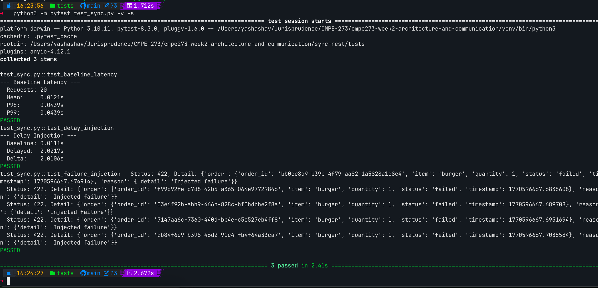
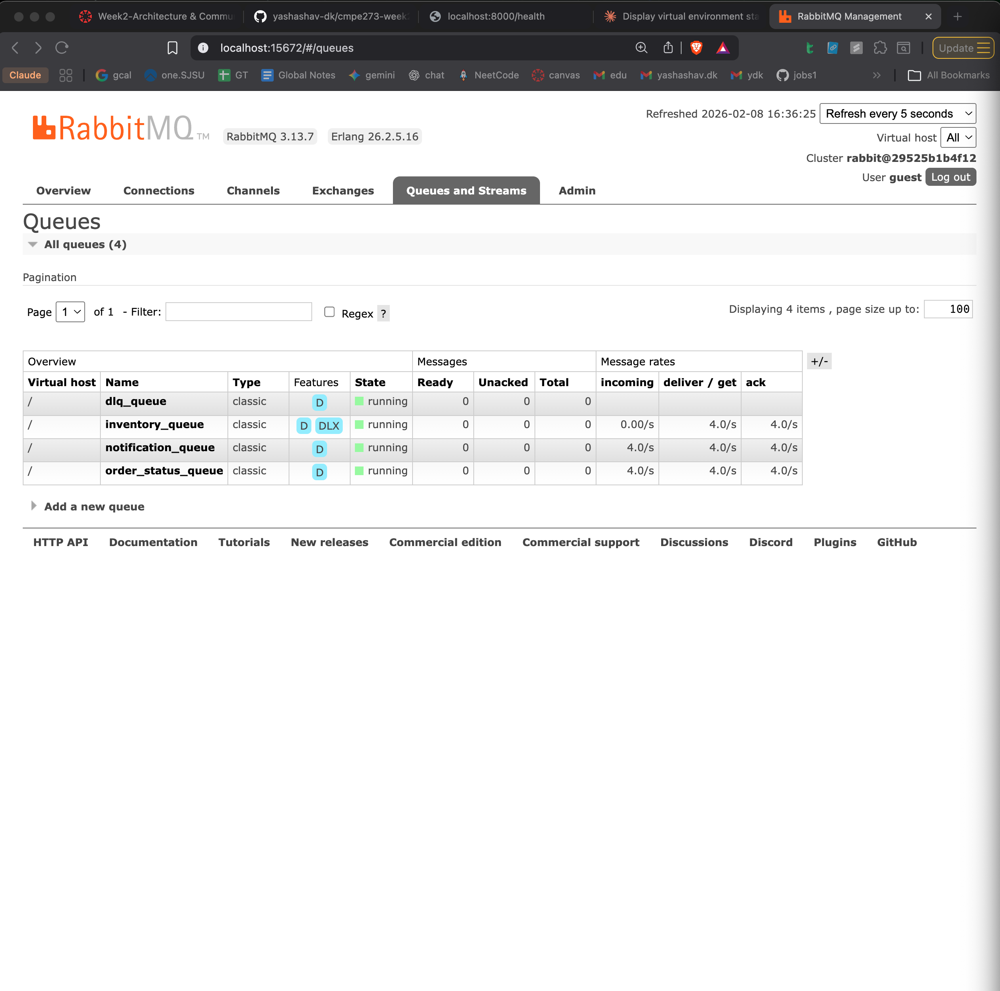
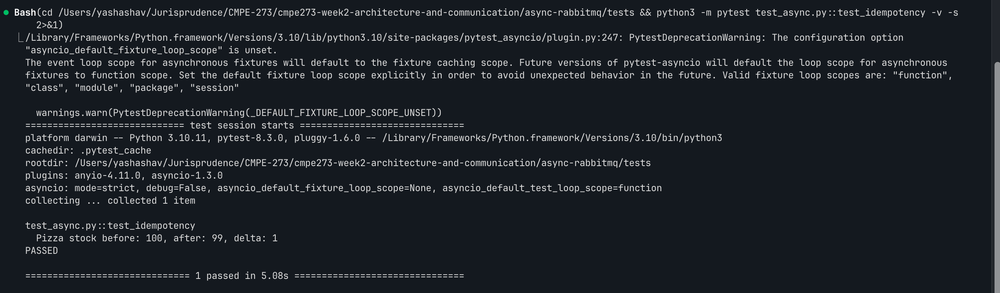
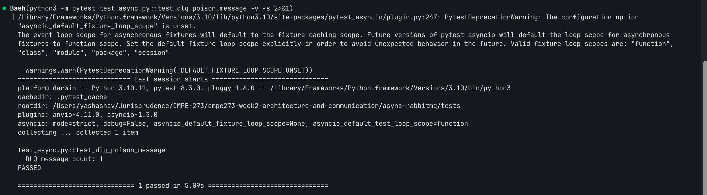
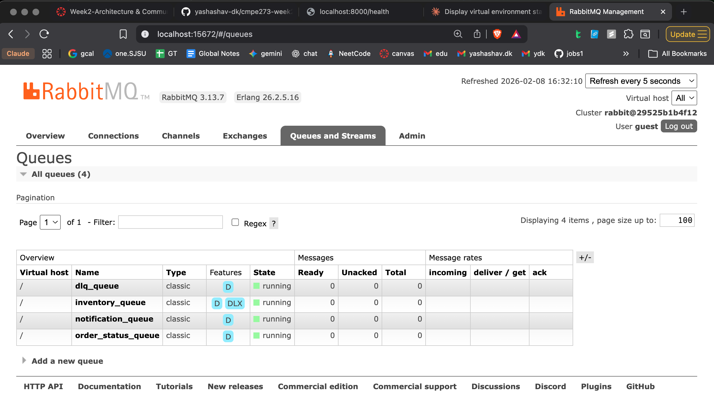
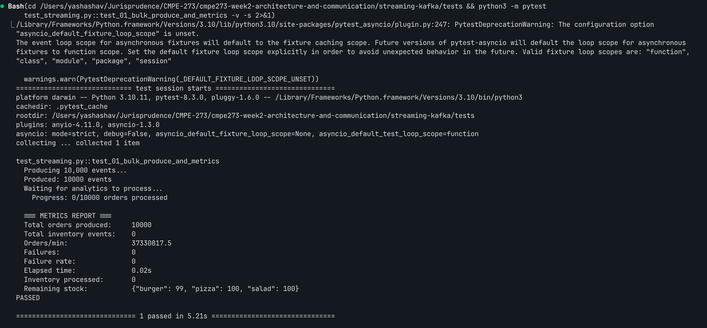
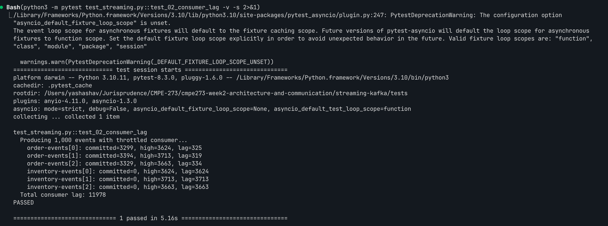
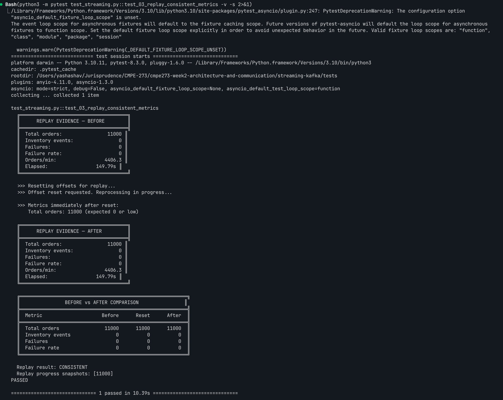

# Campus Food Ordering — Communication Models Lab

**CMPE 273 | Week 2 — Architecture and Communication**

**Team:** Atharva Prasanna Mokashi, Nikhil Raj Singh, Prathamesh Ravindra Sawant, Yashashav Devalapalli Kamalraj

campus food ordering - workflow implemented three ways: synchronous REST, async messaging (RabbitMQ), and streaming (Kafka). Each part is self-contained with its own `docker-compose.yml`, services, and tests.

**Tech Stack:** Python 3.11, FastAPI, httpx, pika, confluent-kafka, Docker Compose

## How to Run

```bash
# Part A — Sync REST
cd sync-rest/tests && bash run_tests.sh

# Part B — Async RabbitMQ
cd async-rabbitmq/tests && bash run_tests.sh

# Part C — Streaming Kafka
cd streaming-kafka/tests && bash run_tests.sh
```

---

## Part A: Synchronous REST

`POST /order` → OrderService calls `POST /reserve` on InventoryService (blocks), then `POST /send` on NotificationService (blocks), returns 201.

### Test Results

- **Baseline latency:** 20 sequential orders — Mean: 0.012s, P95: 0.021s, P99: 0.021s
- **Delay injection:** 2s delay on InventoryService → order latency jumps from ~10ms to ~2s. The delay propagates directly because the call is blocking — OrderService cannot respond until InventoryService completes.
- **Failure injection:** InventoryService returns 500 → OrderService returns 422 for every request. Tight coupling means one broken service breaks the entire flow.



---

## Part B: Async Messaging (RabbitMQ)

`POST /order` → OrderService saves order, publishes `OrderPlaced` to topic exchange, returns 202 immediately. InventoryService consumes `OrderPlaced`, reserves stock, publishes `InventoryReserved` or `InventoryFailed`. NotificationService consumes `InventoryReserved` and logs confirmation.

### Backlog Drain

InventoryService stopped → 20 orders published (all return 202) → messages queue up in `inventory_queue`:


InventoryService restarted → all messages drain and process:



### Idempotency

Same message (same `message_id`) published twice to `inventory_queue`. Stock decremented only once (delta = 1).

**Strategy:** InventoryService maintains a `seen_message_ids: set`. Before processing, it checks if the `message_id` has been seen — if so, it ACKs the message without processing. This prevents double-reservation on redelivery.



### Dead Letter Queue (Poison Message Handling)

Malformed message published to `inventory_queue` → InventoryService calls `basic_nack(requeue=False)` → message routed to DLQ via `dlx_exchange` (dead-letter exchange).




### RabbitMQ Management UI



---

## Part C: Streaming (Kafka)

Producer publishes `OrderPlaced` events to `order-events` topic. InventoryConsumer (group: `inventory-group`) consumes, reserves stock, produces to `inventory-events`. AnalyticsConsumer (group: `analytics-group`) consumes both topics, computes orders/min and failure rate, exposes `GET /metrics`.

### 10,000 Events — Metrics Report



Full metrics report auto-generated at [`streaming-kafka/tests/metrics_report.md`](streaming-kafka/tests/metrics_report.md).

### Consumer Lag

AnalyticsConsumer throttled at 0.1s/message, 1,000 events produced. Committed offsets fall behind high watermarks — consumers process at their own pace independently.



### Replay Evidence

Consumer offsets reset to beginning → metrics cleared → all events reprocessed from the log → totals match original.

| Metric | Before | After |
|---|---|---|
| Total orders | 11,000 | 11,000 |
| Failures | 0 | 0 |
| Result | — | CONSISTENT |

This works because Kafka retains the event log. Unlike RabbitMQ where consumed messages are gone, Kafka consumers can seek to any offset and rebuild state from the stream.


